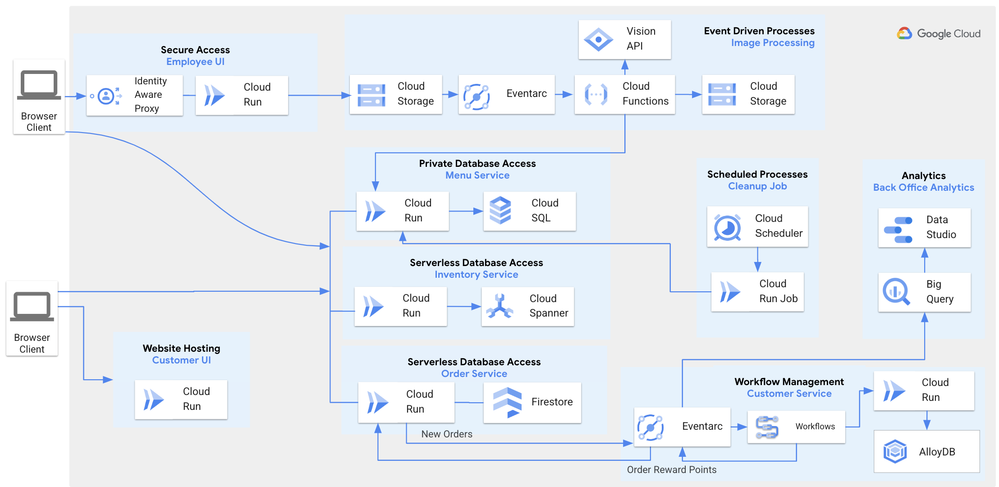

# Cymbal-eats

### Cymbal Eats Architecture




| Service                                                        | Language     | Description                                                                                                                              |
|----------------------------------------------------------------|--------------|------------------------------------------------------------------------------------------------------------------------------------------|
| [customer-ui](./customer-ui)                                   | Vue.js       | Exposes an HTTP server to serve the customer website. Contains login page, rewards page, list of menu items.                             |
| [employee-ui](./employee-ui)                                   | Vue.js       | Exposes an HTTP server to serve the employee website. Contains order processing page, adding new menu items page, inventory update page. |
| [menu-service](./menu-service)                                 | Java         | Manages menu items.                                                                                                                      |
| [inventory-service](./inventory-service/spanner)               | Go           | Manages inventory for menu items.                                                                                                        |
| [order-service](./oser-service)                                | Node.js      | Manages customer orders.                                                                                                                 |
| [customer-service](./customer-service)                         | Java         | Manages customer records. Contains Rewards workflow.                                                                                     |
| [cloud-functions](./cloud-functions)                           | Node.js      | Processes uploaded images for menu items.                                                                                                |
| [cleanup-service](./cleanup-service)                           | Shell script | Manages scheduled clean up process for menu items in failed status.                                                                      |
| [partner-registration-service](./partner-registration-service) | Node.js      | Manages partner registrations.                                                                                                           |

### Request workshop for your team
If you would like to learn more about Google Cloud serverless technologies, please send an email to [esw-request@google.com](mailto:esw-request@google.com) to request workshop delivery.

### New Project Setup

Log in with an Org Admin account,
open Cloud Shell and clone the repo:

```bash
git clone https://github.com/GoogleCloudPlatform/cymbal-eats.git
cd cymbal-eats
```

update environment variables in ```org-admin-setup.sh``` script:
```
ORGANIZATION_ID=your org id
BILLING_ACCOUNT=your billing account id
GCP_USER_ACCOUNT=user@userdomain.altostrat.com
```
execute the script to create new project:

```bash
./org-admin-setup.sh
```

New project will be created and GCP_USER_ACCOUNT will be granted project owner role.

Log in using GCP_USER_ACCOUNT to run rest of the setup.

### Services Deployment

Log in with GCP_USER_ACCOUNT into Cloud Console and select new project that was created in project setup section.

Open Cloud Shell and clone the repo:
```bash
git clone https://github.com/GoogleCloudPlatform/cymbal-eats.git
cd cymbal-eats
```

Review ```config-env.sh``` file and set ```REGION``` to location where you want services to be deployed.

By default ```REGION``` is set to ```us-east1```.

If you want to use existing services,
you can set following environmental variables before running ```./setup.sh``` script.

Example:
```
export ORDER_SERVICE_URL=https://order-service-luu7kai33a-uc.a.run.app
export INVENTORY_SERVICE_URL=https://spanner-inventory-service-luu7kai33a-uc.a.run.app
export MENU_SERVICE_URL=https://menu-service-luu7kai33a-uc.a.run.app
```

### Deploy all services

Run script located in the root of the project to deploy all services.
```bash
./setup.sh
``` 

### Deploy selected services only

Example:

```bash
cd menu-service
./setup.sh
```

Navigate to Cloud Run section in the Cloud Console, open customer-ui-service and click on the URL link.

### IAP configuration for Employee portal

```bash
cd employee-ui
./iap-setup.sh
```

Navigate to ```OAuth consent screen``` in the Cloud Console and change ```Cymbal Eats``` application to ```External``` User type.
Select ```Testing``` for Publishing status.

After that navigate to ```Network services / Load Balancing / Frontends``` section in the Cloud Console.
Copy ```Address``` for ```employee-ui-iap-forwarding-rule``` rule.

Replace IP-ADDRESS with actual IP and open URL in the browser to access Employee Portal.
```
https://IP-ADDRESS.nip.io
```
Certificate provisioning might take up to 15 minutes.

### Add Additional Employee Portal users

Run script and pass valid user email, ex: `user@google.com` or `user@userdomain.altostrat.com`. 
```bash
cd employee-ui
./add-iap-user.sh user@email.com
```

### View urls for Customer and Employee sites

Run script in the root of the repo:
```bash
./get-site-users.sh
```

### Contributing

See [`CONTRIBUTING.md`](CONTRIBUTING.md) for details.

### Code of conduct

See [`CODE-OF-CONDUCT.md`](CODE-OF-CONDUCT.md) for details.

### License

Apache 2.0; see [`LICENSE`](LICENSE) for details.
