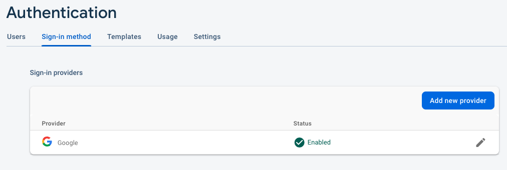
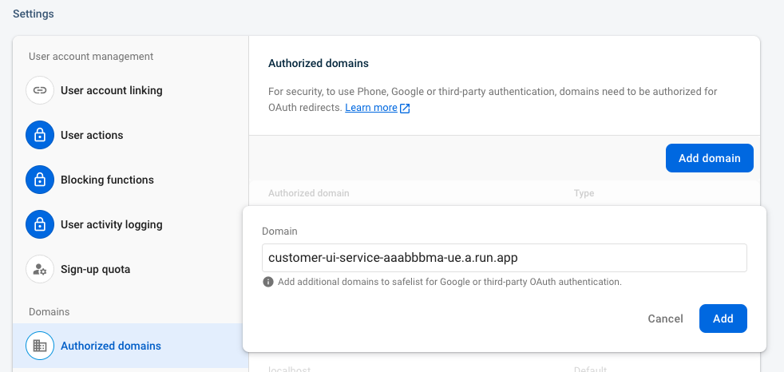

# Cymbal Eats (cymbal-eats)

An app for hungry people

### Deploy the app

```bash
./setup.sh
```


### Complete Firebase configuration manually

#### Enable Google Sign-in provider

Enable Google sign-in provider in Firebase console.
Replace $PROJECT_ID in the url below and open the link in the browser.
```
https://console.firebase.google.com/u/0/project/$PROJECT_ID/authentication
```


#### Add Authorized Domain
Replace $PROJECT_ID in the url below and open the link in the browser.
```
https://console.firebase.google.com/u/0/project/$PROJECT_ID/authentication/settings
```


Copy and paste Customer UI Cloud Run service domain.


